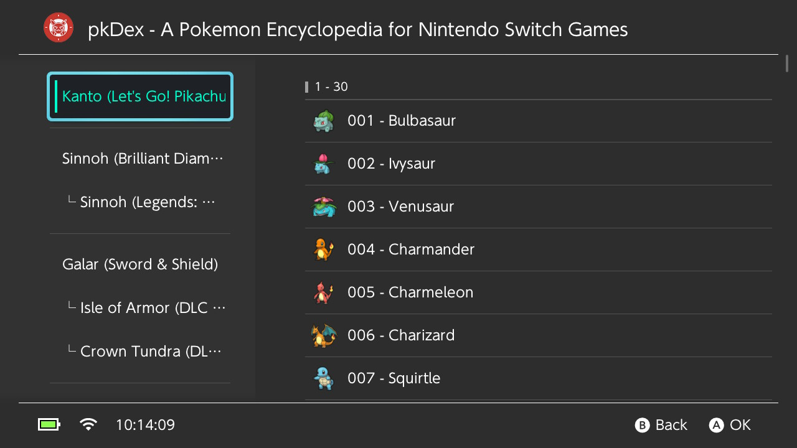
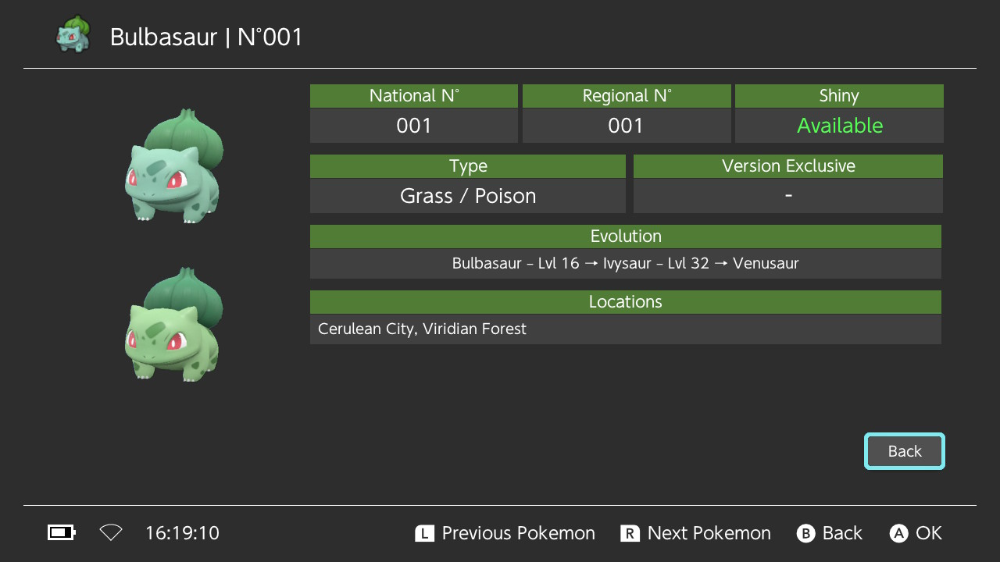
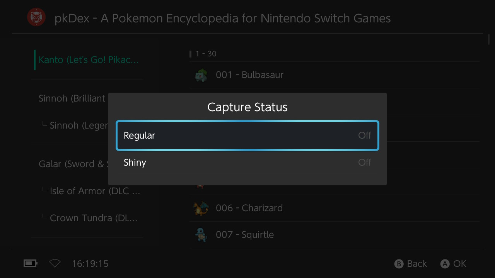
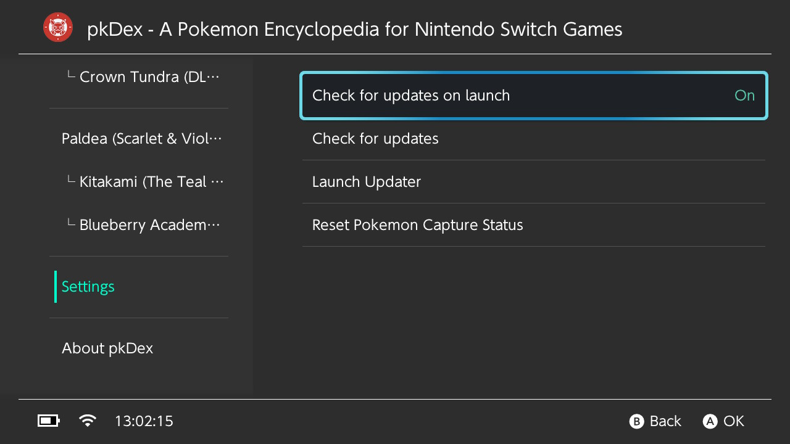
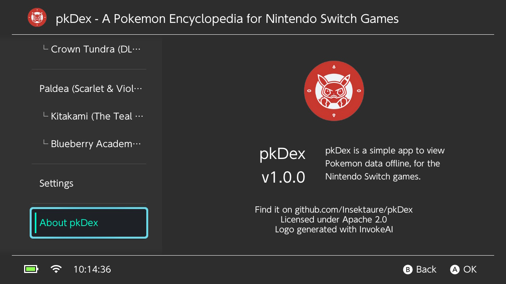

<div align="center">
  
</div>

# pkDex - A Cross-Platform Pokémon Encyclopedia

pkDex is a comprehensive Pokémon encyclopedia (Pokédex) application that allows users to browse and view detailed information about Pokémon from various regions across different generations of the Pokémon games.

Built using the Borealis UI framework, pkDex provides a clean, intuitive interface for exploring Pokémon data.

## Features

- **Multi-Region Support**: Browse Pokémon from different regions:
  - Kanto (Gen 1 - Let's Go Pikachu & Eevee)
  - Sinnoh (Gen 4 - Brilliant Diamond & Shining Pearl)
  - Sinnoh Arceus (Legends: Arceus)
  - Galar (Gen 8 - Sword & Shield)
  - Paldea (Gen 9 - Scarlet & Violet)

- **Detailed Pokémon Information**:
  - National and Regional Pokédex numbers
  - Pokémon types
  - Evolution information
  - Game version exclusivity
  - In-game locations
  - Images of both standard and shiny forms
  - Packaged low resolution images, with dynamic loading high resolution if available on the SD card

- **User-Friendly Interface**:
  - Organized by regions with section headers
  - Efficient list navigation with recycling views
  - Detailed view for each Pokémon
  - Dark theme support

- **Settings / QoL**:
  - Update check on startup (to ensure you have the latest version **-Enable by default-**)
  - Disable automatic update check on startup (for those who prefer not to check for updates)

- **Cross-Platform Compatibility**:
  - Nintendo Switch (primary target)

## Requirements

### For Building

- CMake 3.10 or higher
- A C++17 compatible compiler
- Platform-specific development tools:
  - For Switch: devkitPro with Switch development tools
  - For PS4/PSV: Appropriate SDK (for PlayStation platforms)
  - For Desktop: Standard development tools for your platform

### Dependencies

- Borealis UI framework (included as a submodule)
- SDL2 (for some platforms - included as a submodule)
- Platform-specific libraries (handled by the build system)

## Building

### Common Setup

1. Clone the repository with submodules:
   ```bash
   git clone --recursive https://github.com/Insektaure/pkDex.git
   cd pkDex
   ```

2. If you didn't clone with `--recursive`, initialize the submodules:
   ```bash
   git submodule update --init --recursive
   ```

### Building for Nintendo Switch

1. Make sure you have devkitPro installed with Switch development tools.

2. Build the application:
   ```bash
   make build-switch
   ```

3. The output will be a `.nro` file in the `build_switch`folder that can be run on a Nintendo Switch with custom firmware.

If you want to speed up the build process, you can use edit the `Makefile` and replace

```makefile
make -C build_switch pkDex.nro -j2
```

with

```makefile
make -C build_switch pkDex.nro -j$(nproc)
```

## Usage

1. Launch the application on your device.
2. Navigate through the tabs to select a Pokémon region.
3. Browse the list of Pokémon, organized by their regional Pokédex numbers.
4. Select a Pokémon to view detailed information, including:
   - Images (standard and shiny forms)
   - National Pokédex number
   - Regional Pokédex number
   - Type information
   - Evolution details
   - Location information
   - Version exclusivity

## App Settings

The application includes a settings menu that allows users to:
- Enable or disable automatic update checks on startup
- Check for updates manually
- View application version information

Enabling automatic update checks will prompt the application to check for the latest version on startup, ensuring you always have the most up-to-date information.

Changing the settings will generate a `config.ini` file in the `/config/pkDex` directory, which will be used to store user preferences.

## Project Structure

- `app/`: Application source code
  - `include/`: Header files
  - `src/`: Implementation files
    - `activity/`: Application activities
    - `data/`: Data loading and management
    - `tab/`: UI tabs for different sections
    - `view/`: UI views for displaying content

- `resources/`: Application resources
  - `data/`: Pokémon data files
  - `i18n/`: Internationalization files
  - `img/`: Images including Pokémon sprites and icons
  - `xml/`: UI layout definitions

- `library/`: External libraries
  - `borealis/`: Borealis UI framework

- `screenshots/`: Screenshots of the application for documentation purposes

## Screenshots

<div align="center">
    
    <br>
    
    <br>
    
    <br>
    
    <br>
    
</div>

## Credits

- **Borealis UI Framework**: A hardware-accelerated UI library for Nintendo Switch homebrew, developed by natinusala and contributors. [GitHub Repository](https://github.com/natinusala/borealis)
- **Pokémon Data**: All Pokémon names, images, and data are property of Nintendo, Game Freak, and The Pokémon Company.
- **Development**: pkDex is developed by Insektaure.
- **Datasets**: Pokémon data sourced from various community resources and official game data (serebii.net / pokemondb.net / bulbapedia.bulbagarden.net).
- Switchbrew for their research and [libnx](https://github.com/switchbrew/libnx) which makes it possible to create homebrew
- ReSwitched for their research, [Atmosphere](https://github.com/Atmosphere-NX/Atmosphere), and [libstratosphere](https://github.com/Atmosphere-NX/libstratosphere) which is invaluable for Switch homebrew

## License

This project is licensed under the GNU General Public License v2.0 - see the [LICENSE](LICENSE) file for details.

## Disclaimer

This application is not affiliated with, endorsed by, or related to Nintendo, Game Freak, or The Pokémon Company. Pokémon and Pokémon character names are trademarks of Nintendo. This application is intended for educational and informational purposes only.