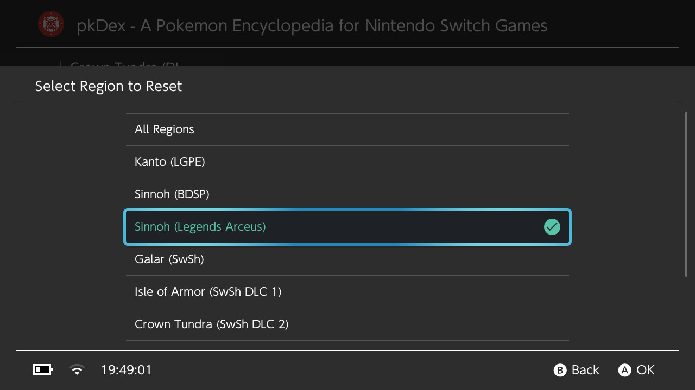
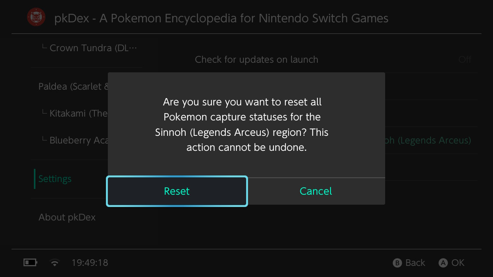
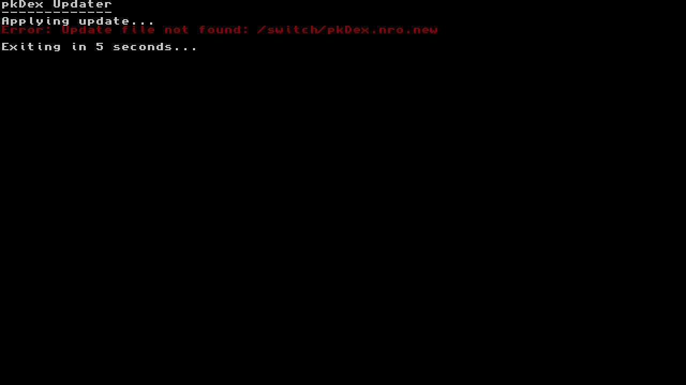
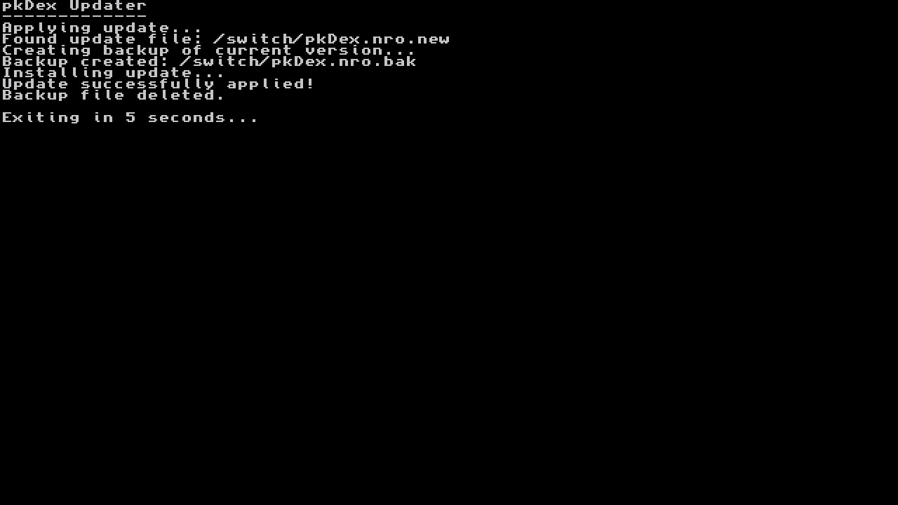

<div align="center">
  
</div>

# pkDex - A Cross-Platform Pokémon Encyclopedia

pkDex is a comprehensive Pokémon encyclopedia (Pokédex) application that allows users to browse and view detailed information about Pokémon from various regions across different generations of the Pokémon games.

Built using the Borealis UI framework, pkDex provides a clean, intuitive interface for exploring Pokémon data.

## Disclaimer

This application is provided for educational and informational purposes only.\
It is provided "as is" without any warranties or guarantees of any kind.\
The developers are not responsible for any issues that may arise from using this application.

## Features

- **Multi-Region Support**: Browse Pokémon from different regions:
  - Kanto (Gen 1 - Let's Go Pikachu & Eevee)
  - Sinnoh (Gen 4 - Brilliant Diamond & Shining Pearl)
  - Sinnoh Arceus (Legends: Arceus)
  - Galar (Gen 8 - Sword & Shield + Isle of Armor & Crown Tundra DLC)
  - Paldea (Gen 9 - Scarlet & Violet + The Teal Mask & The Indigo Disk DLC)
  - Kalos (Legends: Z-A)

- **Detailed Pokémon Information**:
  - National and Regional Pokédex numbers
  - Shiny Lock status
  - Pokémon types
  - Evolution information
  - Game version exclusivity
  - In-game locations
  - Images of both standard and shiny forms
  - Packaged low resolution images, with dynamic loading high resolution if available on the SD card

- **Pokémon Tracker**:
  - Track caught Pokémon by marking them as caught on the list
  - Caught Pokémon are highlighted in the list
  - Ability to reset caught status for all Pokémon from the `settings` menu
  - Ability to reset caught status for specific Region from the `settings` menu
  - Caught status is saved in a `pkDex.tracker.{REGION}.ini` file in the `/switch/pkDex` directory (1 file per region)

- **User-Friendly Interface**:
  - Organized by regions with section headers
  - Efficient list navigation with recycling views
  - Detailed view for each Pokémon
  - Dark theme support

- **Settings / QoL**:
  - Update check on startup (to ensure you have the latest version **-Enable by default-**)
  - Disable automatic update check on startup (for those who prefer not to check for updates)
  - Download updates directly from the application (**_must use the included Updater to apply updates_**)
  - If the updater application is not present, it will prompt you to download it from the `settings` menu when trying to launch it.
  - Can hide the bottom status bar
  - Download & Extract the High Resolution images pack directly from the application from the `settings` menu (requires an internet connection)

- **Cross-Platform Compatibility**:
  - Nintendo Switch (primary target)

## How to Use

1. Launch the application on your device.
2. Navigate through the tabs to select a Pokémon region.
3. Browse the list of Pokémon, organized by their regional Pokédex numbers.
4. Select a Pokémon to view detailed information, including:
    - Images (standard and shiny forms)
    - National Pokédex number
    - Regional Pokédex number
    - Shiny Lock status
    - Type information
    - Evolution details
    - Location information
    - Version exclusivity
5. Press the `Y` button to mark a Pokémon as caught or uncaught. Caught Pokémon will be highlighted in the list.
6. Marking a Pokémon as caught will create a `pkDex.tracker.{REGION}.ini` file in the `/switch/pkDex` directory.\
   Unmarking a Pokémon will set the corresponding line in `pkDex.tracker.{REGION}.ini` file accordingly. 
7. Use the settings menu to enable or disable automatic new version checks & check for available updates manually. 
8. Use the settings menu to download updates directly from the application (requires the `pkDexUpdater` application to be present to use update file). 
9. Use the included updater application (`pkDexUpdater.nro`) to apply the downloaded update file.
10. Use the settings menu to Download & Extract the High Resolution images pack directly from the application (requires an internet connection).

## How to Update

To update the application, you can use the included updater application (`pkDexUpdater.nro`):
1. Ensure your Nintendo Switch is connected to the internet.
2. Go to the settings menu and check for updates.

If an update is available, the application will prompt you to download it. 

If you want to update automatically :
- Click the `Launch Updater` button in the settings menu of the main application. 
- If you don't have the Updater, you will be prompted to download it **directly from the application settings**.
- The updater will apply the downloaded update file to the main application, ensuring you have the latest features and bug fixes.

If you prefer to update manually:
- Download the latest version from the [releases page](https://github.com/Insektaure/pkDex/releases).

## App Settings

The application includes a settings menu that allows users to:
- Enable or disable automatic update checks on startup
- Check for updates manually
- Download updates directly from the application
- Download the updater application if it is not present
- Reset caught Pokémon status
- Download & Extract the High Resolution images pack directly from the application (requires an internet connection)

Enabling automatic update checks will prompt the application to check for the latest version on startup, ensuring you always have the most up-to-date information.\
You can download updates at any time from the `settings` menu (_**Check for updates**_ button).

## Localization (i18n)

pkDex supports multiple languages using JSON translation files loaded at runtime.

- UI strings in XML use i18n references like `@i18n/pkdex/...`.
- Translation files are located in `resources/i18n/<locale>/*.json`.
- The default English strings are in `resources/i18n/en-US/pkdex.json`.
- To add a new language, create `resources/i18n/<your-locale>/pkdex.json` with the same keys.

Overriding data from XML files:
- Game data (for example, Pokémon names, types, evolution text, locations, etc.) are read from the XML files in `resources/data/<region>.xml`.
- You can override any of these texts per locale by adding entries under `data/<region>/<id>/<field>` in your locale JSON.
    - Example (French):
        - `data/kanto/001/name`: Bulbizarre
        - `data/kanto/001/type`: Plante / Poison
        - Fields supported: `name`, `type`, `evolution`, `locations`, `exclusiveVersion`.
- If an override key is missing, the app will fall back to the original text in the XML.

Locales follow Borealis conventions with a fallback to `en-US` as the default.

## Config save

Changing the settings will generate a `config.ini` file in the `/config/pkDex` directory, which will be used to store user preferences.

## Requirements

### For Building

- CMake 3.10 or higher
- A C++17 compatible compiler
- Platform-specific development tools:
  - For Switch: devkitPro with Switch development tools
  - For PS4/PSV: Appropriate SDK (for PlayStation platforms)
  - For Desktop: Standard development tools for your platform

### Dependencies

- Borealis UI framework (included as a submodule)
- SDL2 (for some platforms - included as a submodule)
- Platform-specific libraries (handled by the build system)

## Building

### Common Setup

1. Clone the repository with submodules:
   ```bash
   git clone --recursive https://github.com/Insektaure/pkDex.git
   cd pkDex
   ```

2. If you didn't clone with `--recursive`, initialize the submodules:
   ```bash
   git submodule update --init --recursive
   ```

### Building for Nintendo Switch

1. Make sure you have devkitPro installed with Switch development tools.

2. Build the application:
   ```bash
   make build-switch
   ```

3. The output will be a `.nro` file in the `build_switch`folder that can be run on a Nintendo Switch with custom firmware.

If you want to speed up the build process, you can use edit the `Makefile` and replace

```makefile
make -C build_switch pkDex.nro -j2
```

with

```makefile
make -C build_switch pkDex.nro -j$(nproc)
```

### Building for Nintendo Switch (Updater application)

1. Make sure you have devkitPro installed with Switch development tools.

2. Build the updater application:
   ```bash
   make build-updater
   ```
   
3. The output will be a `.nro` file in the `build_switch/pkDexUpdater` folder that can be run on a Nintendo Switch with custom firmware.

if you want to speed up the build process, you can use edit the `Makefile` and replace

```makefile
make -C build_switch pkDexUpdater.nro -j2
```

with

```makefile
make -C build_switch pkDexUpdater.nro -j$(nproc)
```

### Building for Nintendo Switch (Main Application and Updater)

To build both the main application and the updater in one command, you can use:

```bash
make build-all
```


## Project Structure

- `app/`: Application source code
  - `include/`: Header files
  - `src/`: Implementation files
    - `activity/`: Application activities
    - `data/`: Data loading and management
    - `tab/`: UI tabs for different sections
    - `view/`: UI views for displaying content

- `pkDexUpdater/`: Update checker application
  - `src/`: Implementation files for the updater
  - `ressources/`: Resources for the updater application
    - `img/`: Images for the updater UI

- `resources/`: Application resources
  - `data/`: Pokémon data files
  - `i18n/`: Internationalization files
  - `img/`: Images including Pokémon sprites and icons
  - `xml/`: UI layout definitions

- `library/`: External libraries
  - `borealis/`: Borealis UI framework

- `screenshots/`: Screenshots of the application for documentation purposes

## Screenshots

<div align="center">
    
    <br>
    
    <br>
    
    <br>
    
    <br>
    
    <br>
    
    <br>
    
    <br>
    
    <br>
    
</div>

## Credits

- **Borealis UI Framework**: A hardware-accelerated UI library for Nintendo Switch homebrew, developed by natinusala and contributors. [GitHub Repository](https://github.com/natinusala/borealis)
- **Pokémon Data**: All Pokémon names, images, and data are property of Nintendo, Game Freak, and The Pokémon Company.
- **Development**: pkDex is developed by Insektaure.
- **Datasets**: Pokémon data sourced from various community resources and official game data (serebii.net / pokemondb.net / bulbapedia.bulbagarden.net).
- Switchbrew for their research and [libnx](https://github.com/switchbrew/libnx) which makes it possible to create homebrew
- ReSwitched for their research, [Atmosphere](https://github.com/Atmosphere-NX/Atmosphere), and [libstratosphere](https://github.com/Atmosphere-NX/libstratosphere) which is invaluable for Switch homebrew

## License

This project is licensed under the GNU General Public License v2.0 - see the [LICENSE](LICENSE) file for details.

## Disclaimer

This application is not affiliated with, endorsed by, or related to Nintendo, Game Freak, or The Pokémon Company. Pokémon and Pokémon character names are trademarks of Nintendo. This application is intended for educational and informational purposes only.