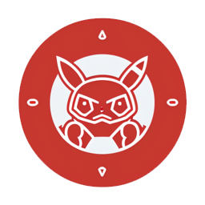
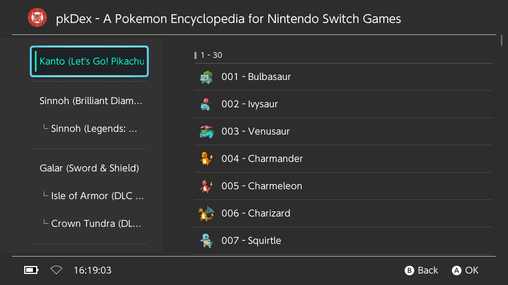

<div align="center">
  
</div>

# pkDex - A Cross-Platform Pokémon Encyclopedia

pkDex is a comprehensive Pokémon encyclopedia (Pokédex) application that allows users to browse and view detailed information about Pokémon from various regions across different generations of the Pokémon games.

Built with SDL2, pkDex provides a clean, controller-driven interface for exploring Pokémon data.

## Disclaimer

This application is provided for educational and informational purposes only.\
It is provided "as is" without any warranties or guarantees of any kind.\
The developers are not responsible for any issues that may arise from using this application.

## Features

- **Multi-Region Support**: Browse Pokémon from different regions:
  - Kanto (Gen 1 - Let's Go Pikachu & Eevee)
  - Sinnoh (Gen 4 - Brilliant Diamond & Shining Pearl)
  - Sinnoh Arceus (Legends: Arceus)
  - Galar (Gen 8 - Sword & Shield + Isle of Armor & Crown Tundra DLC)
  - Paldea (Gen 9 - Scarlet & Violet + The Teal Mask & The Indigo Disk DLC)
  - Kalos (Legends: Z-A + Mega-Dimension DLC)

- **Detailed Pokémon Information**:
  - National and Regional Pokédex numbers
  - Shiny Lock status
  - Pokémon types
  - Evolution information
  - Game version exclusivity
  - In-game locations
  - Images of both standard and shiny forms
  - Packaged low resolution images, with dynamic loading high resolution if available on the SD card

- **Pokémon Tracker**:
  - Track caught Pokémon by marking them as caught on the list
  - Caught Pokémon are highlighted in the list with icons for easy identification
  - Toggle caught status by pressing the `Y` button on the list entry
  - Can track Regular, Shiny, Alpha & Shiny Alpha separately (if available in selected game)
  - **Bulk Actions**: Press the `X` button to mark or clear an entire region's dex at once (e.g. mark all as Caught, clear all Shiny, etc.)
  - **Multi-Select**: Press `ZL` to toggle multi-select mode, use `A` to select/deselect individual Pokémon, then press `Y` to apply status changes to all selected at once. Selection is kept between status changes so you can apply multiple statuses without re-selecting.
  - Ability to reset caught status for all Pokémon from the `settings` menu
  - Ability to reset caught status for specific Region from the `settings` menu
  - Caught status is saved in a `pkDex.tracker.{REGION}.ini` file in the `/switch/pkDex` directory (1 file per region)

- **User-Friendly Interface**:
  - Organized by regions with section headers
  - Efficient list navigation with recycling views
  - Detailed view for each Pokémon
  - Dark theme support

- **Settings / QoL**:
  - Update check on startup (to ensure you have the latest version **-Enable by default-**)
  - Disable automatic update check on startup (for those who prefer not to check for updates)
  - Built-in updater: downloads, verifies and installs the new version, then restarts pkDex (no separate updater app)
  - Can hide the bottom status bar
  - Change language instantly (defaults to the console's language)
  - Download & Extract the High Resolution images pack directly from the application from the `settings` menu (requires an internet connection)

- **Cross-Platform Compatibility**:
  - Nintendo Switch (primary target)

## How to Use

1. Launch the application on your device.
2. Pick a region in the sidebar (`Up`/`Down`), then press `A` or `Right` to browse its Pokédex.
3. Browse the grid with the D-Pad or the left stick; `L`/`R` jump 30 Pokémon at a time.
4. Press `A` on a Pokémon to open its page:
    - Large sprite, with `X` to switch between the Regular and Shiny views
    - National and Regional Pokédex numbers, Shiny Lock status, version exclusivity
    - Type, evolution chain and in-game locations
    - `L`/`R` move to the previous / next Pokémon
5. Press `Y` to open the capture status popup and toggle Regular, Shiny, Alpha & Shiny Alpha.
6. Press `X` to open the Bulk Actions popup, to mark or clear a capture status for the whole region at once.
7. Press `ZL` to toggle multi-select mode. Use `A` to select individual Pokémon, then `Y` to apply a status to all of them. Press `ZL` or `B` to leave multi-select mode.
8. Capture statuses are saved in `pkDex.tracker.{REGION}.ini` files in the `/switch/pkDex` directory (1 file per region).
9. Use the Settings page (bottom of the sidebar) to check for and install updates, reset capture statuses, change the language and download the High Resolution images pack.
10. Press `+` to quit.

## How to Update

pkDex updates itself:
1. Ensure your Nintendo Switch is connected to the internet.
2. With *Check for updates on launch* enabled, pkDex tells you when a new version is out. You can also use *Check for updates* in the Settings page.
3. Choose *Install update*. pkDex downloads the release's `pkDex.zip`, unpacks the app from it, checks it, backs up the current one, installs it and restarts.

If anything goes wrong, the current version is kept. An install from before 2.0.0 (`/switch/pkDex.nro`) is moved to `/switch/pkDex/pkDex.nro` by its first update: the new version is written there, pkDex restarts into it, and the old copy is deleted. The separate `pkDexUpdater.nro` from earlier releases is no longer needed, and is removed when found.

If you prefer to update manually:
- Download `pkDex.zip` from the [releases page](https://github.com/Insektaure/pkDex/releases) and extract it to the root of the SD card: the app goes to `/switch/pkDex/pkDex.nro`. (Up to 1.6.5, releases shipped a bare `pkDex.nro`, usually kept at `/switch/pkDex.nro`; the new version deletes that one at its first start, so the homebrew menu does not list pkDex twice.)

## App Settings

The application includes a settings page that allows users to:
- Enable or disable automatic update checks on startup
- Check for updates manually, and install them
- Reset caught Pokémon status (for all regions or one)
- Hide the bottom status bar
- Change language for UI & data (if available)
- Download & Extract the High Resolution images pack directly from the application (requires an internet connection)

## Localization (i18n)

pkDex supports multiple languages using JSON translation files loaded at runtime.

- Translation files are located in `resources/i18n/<locale>/pkdex.json`; nested keys are read as paths (`settings/title`).
- The default English strings are in `resources/i18n/en-US/pkdex.json`. Any key missing from a translation falls back to English.
- The `pkdex.json` files are generated by `tools/gen_i18n.py`: edit the strings there and run `python3 tools/gen_i18n.py`. It refuses to write anything if a locale is missing a key or has an extra one.
- To add a new language, add its table to `tools/gen_i18n.py` and the locale to the list in `source/i18n.cpp`.

Overriding data from the data files:
- Game data (for example, Pokémon names, types, evolution text, locations, etc.) are read from `resources/data/<region>.json`.
- You can override any of these texts per locale in `resources/i18n/<locale>/data.json`, under `<region>/<regional number>/<field>`.
    - Example (French): `kanto` → `001` → `name`: Bulbizarre, `type`: Plante / Poison
    - Fields supported: `name`, `type`, `evolution`, `locations`, `exclusiveVersion`.
- If an override key is missing, the app will fall back to the original text in the data file.

Text is drawn with the console's system fonts, so Japanese, Korean and Chinese glyphs are available.

## Config save

Changing the settings will generate a `config.ini` file in the `/config/pkDex` directory, which will be used to store user preferences.

## Requirements

### For Building

- [devkitPro](https://github.com/devkitpro) with the Switch tools (devkitA64, libnx) and these portlibs:
  ```bash
  dkp-pacman -S switch-sdl2 switch-sdl2_ttf switch-sdl2_image switch-curl switch-mbedtls switch-zlib switch-minizip
  ```
- Optional: [jq](https://jqlang.org/download/), to minify the JSON files in the RomFS

## Building

```bash
make
```

The output is `pkDex.nro` at the root of the repository. The RomFS is staged from `resources/` into `build/romfs` on every build.

## Project Structure

- `source/`, `include/`: Application source code
  - `app.cpp`, `ui_dex.cpp`, `ui_pages.cpp`, `ui_modals.cpp`: Main loop, screens and popups
  - `gfx.cpp`: SDL2 renderer helpers (system fonts, shapes, icons, images)
  - `dex.cpp`, `tracker.cpp`: Pokémon data and capture tracking
  - `update.cpp`, `pack.cpp`, `net.cpp`: Self-update, high-resolution image pack, HTTPS
- `resources/`: Application resources (packed into the RomFS)
  - `data/`: Pokémon data files
  - `i18n/`: Internationalization files
  - `img/`: Images including Pokémon sprites and icons
  - `cacert.pem`: Root certificates for GitHub
- `screenshots/`: Screenshots of the application for documentation purposes

## Screenshots

For static images, see the `screenshots` folder.

<div align="center">
    
</div>

## Credits

- **SDL2**: [libsdl.org](https://www.libsdl.org/), with SDL_ttf and SDL_image
- **[pkHouse](https://github.com/Insektaure/pkHouse)**: the self-updater, the rounded-shape rendering, the capture status icons and the type colours come from it
- **Pokémon Data**: All Pokémon names, images, and data are property of Nintendo, Game Freak, and The Pokémon Company.
- **Development**: pkDex is developed by Insektaure.
- **Datasets**: Pokémon data sourced from various community resources and official game data (serebii.net / pokemondb.net / bulbapedia.bulbagarden.net).
- Switchbrew for their research and [libnx](https://github.com/switchbrew/libnx) which makes it possible to create homebrew
- ReSwitched for their research, [Atmosphere](https://github.com/Atmosphere-NX/Atmosphere), and [libstratosphere](https://github.com/Atmosphere-NX/libstratosphere) which is invaluable for Switch homebrew
- @Dev9212 for helping on the German translation
## License

This project is licensed under the GNU General Public License v2.0 - see the [LICENSE](LICENSE) file for details.

## Disclaimer

This application is not affiliated with, endorsed by, or related to Nintendo, Game Freak, or The Pokémon Company. Pokémon and Pokémon character names are trademarks of Nintendo. This application is intended for educational and informational purposes only.